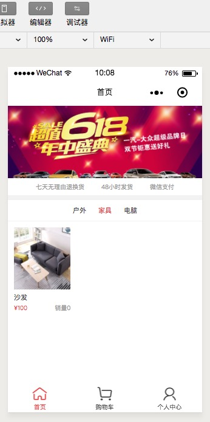
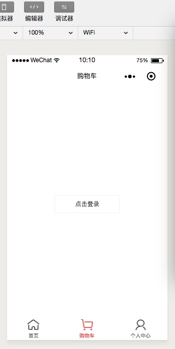
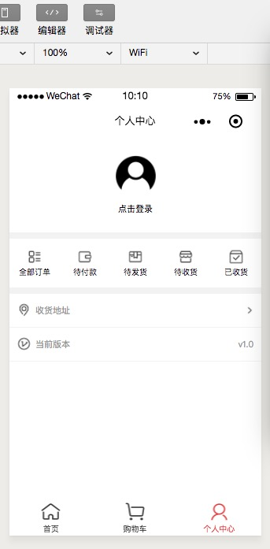
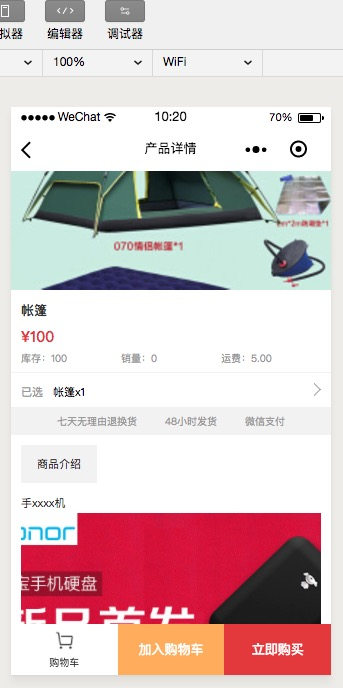

### 预览

<div></div>
<div></div>
<div></div>
<div></div>

### 安装使用

#### 安装依赖包

```console
npm install
```

#### 开发实时编译

```console
npm run dev
```

#### 其他

```console
1、使用微信开发者工具-->添加项目，项目目录请选择dist目录。

2、微信开发者工具-->项目-->关闭ES6转ES5。 重要：漏掉此项会运行报错。

3、微信开发者工具-->项目-->关闭上传代码时样式自动补全。 重要：某些情况下漏掉此项也会运行报错。

4、微信开发者工具-->项目-->关闭代码压缩上传。 重要：开启后，会导致真机computed, props.sync 等等属性失效。（注：压缩功能可使用WePY提供的build指令代替，详见后文相关介绍以及Demo项目根目录中的wepy.config.js和package.json文件。）

5、本地项目根目录运行wepy build --watch，开启实时编译。（注：如果同时在微信开发者工具-->设置-->编辑器中勾选了文件保存时自动编译小程序，将可以实时预览，非常方便。）
```
